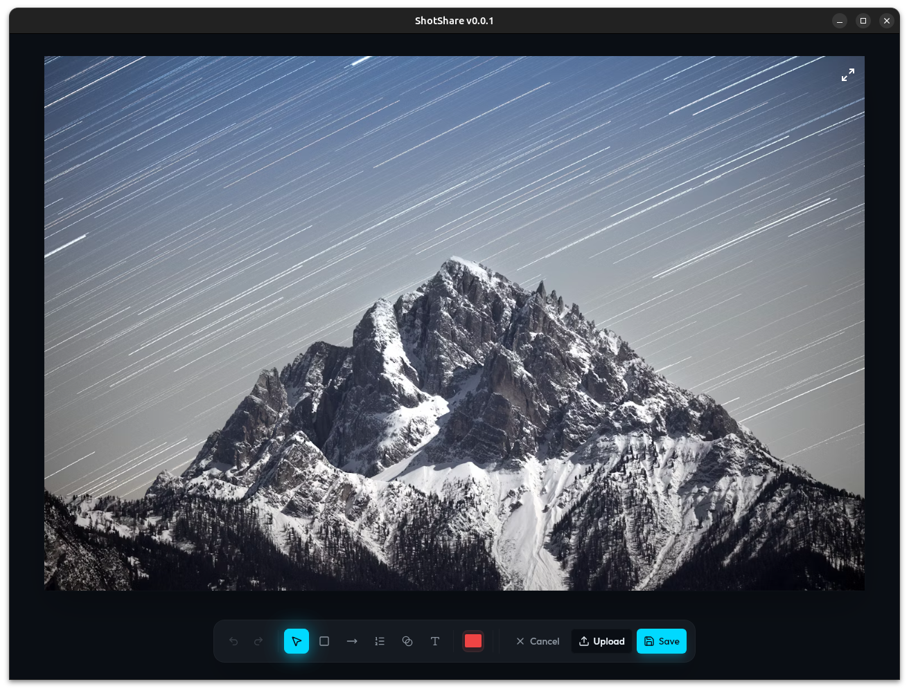

# Shot Share 📸

Simple screenshot tool with SFTP upload feature.

## Features

- **Fast Screenshots** - Global hotkey (Ctrl+Shift+S) for instant capture
- **Built-in Editor** - Annotate with rectangles, arrows, text, blur, and numbered steps
- **Auto Upload** - SFTP integration with clipboard URL copy
- **System Tray** - Always accessible from your system tray
- **Cross-Platform** - Windows, macOS, and Linux support

## Installation

Download the latest release for your platform:

**[📥 Download Latest Release](https://github.com/mkluszczynski/shot-share/releases)**

### Build from Source

**Prerequisites:** Node.js 18+, pnpm, Rust

```bash
git clone https://github.com/mkluszczynski/shot-share.git
cd shot-share
pnpm install
pnpm tauri dev
```

## Usage

1. **Take Screenshot** - Press `Ctrl+Shift+S` (configurable)
2. **Edit** - Use toolbar to add annotations
3. **Upload** - Click Upload button, URL auto-copied to clipboard

**Keyboard Shortcuts:**
- `Ctrl+Z` / `Ctrl+Y` - Undo/Redo
- `Delete` - Remove selected shape
- `Escape` - Cancel/Deselect

## Configuration

Configure in Settings:
- **Save Directory** - Where screenshots are saved
- **Shortcut** - Custom global hotkey
- **SFTP** - Server, credentials, and upload path

## Tech Stack

Built with Tauri 2, React 18, TypeScript, Tailwind CSS, and Konva for editing.

## License

MIT License - see LICENSE file for details.
